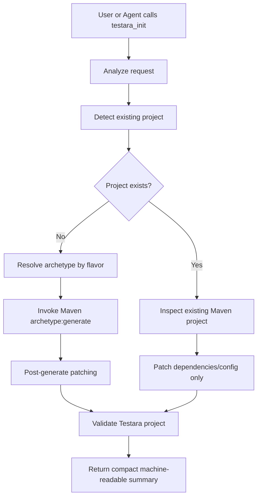

# Testara Archetype + `testara_init` Integration Plan

## 1. Objective

Integrate Maven archetype-based project scaffolding into `testara_init` so Testara can generate deterministic, versioned, Maven-native automation projects while keeping the agent workflow token-efficient.

The intended architecture is:

```text
Maven Archetype = deterministic project skeleton
testara_init    = smart wrapper, flavor selector, validator, and upgrader
```

This allows Testara to support both:

1. Normal developer usage through Maven CLI.
2. Agentic usage through compact `testara_init` tool calls.

---

## 2. Problems to Solve

Current `testara_init` is likely too generative. It asks the agent or tool to create many project files directly, which causes high token usage and makes the output less deterministic.

Observed issues:

| Problem | Impact |
|---|---|
| Full project files are generated through agent/tool output | High token usage |
| Bootstrap layout can vary per agent/session | Lower reproducibility |
| `pom.xml`, runner, properties, and hooks may drift from Testara conventions | Harder maintenance |
| Init flow returns too much content | More context pollution |
| Existing project detection is not clearly separated from fresh project creation | Risk of overwrite or bad patching |
| Users cannot easily scaffold without AI | Poor non-agent DX |

The archetype should solve the base scaffold problem. `testara_init` should solve the orchestration problem.

---

## 3. Target Design

### 3.1 High-Level Flow



### 3.2 Responsibility Split

| Component | Responsibility |
|---|---|
| Maven archetype | Generate static project skeleton |
| `testara_init` | Select archetype, invoke Maven, patch, validate, summarize |
| `testara_bootstrap` | Generate pages, locators, actions, domain code |
| `testara_plan` | Generate one or more feature files from known actions |
| `testara_run` | Execute Maven/Testara and return summarized logs |
| `testara_validate` | Validate project convention, tags, actions, pages, dependencies |

---

## 4. Repository Layout

Recommended initial placement: keep archetypes inside the main Testara repository.

```text
testara/
  pom.xml

  testara-core/
  testara-api/
  testara-ui/
  testara-cucumber/
  testara-ui-cucumber/
  testara-agent-tools/
  testara-cli/

  testara-archetypes/
    pom.xml

    testara-archetype-basic/
      pom.xml
      src/main/resources/
        META-INF/maven/archetype-metadata.xml
        archetype-resources/
          pom.xml
          README.md
          src/test/java/__packageInPathFormat__/runner/CucumberTestRunner.java
          src/test/java/__packageInPathFormat__/hooks/TestaraHooks.java
          src/test/resources/application.properties
          src/test/resources/configuration.properties
          src/test/resources/cucumber.properties
          src/test/resources/junit-platform.properties
          src/test/resources/log4j2.xml
          src/test/resources/features/.gitkeep

    testara-archetype-ui-cucumber/
      pom.xml
      src/main/resources/
        META-INF/maven/archetype-metadata.xml
        archetype-resources/
          pom.xml
          README.md
          src/test/java/__packageInPathFormat__/runner/CucumberTestRunner.java
          src/test/java/__packageInPathFormat__/pages/.gitkeep
          src/test/java/__packageInPathFormat__/actions/.gitkeep
          src/test/java/__packageInPathFormat__/hooks/TestaraHooks.java
          src/test/resources/application.properties
          src/test/resources/configuration.properties
          src/test/resources/cucumber.properties
          src/test/resources/junit-platform.properties
          src/test/resources/log4j2.xml
          src/test/resources/features/.gitkeep

    testara-archetype-api-cucumber/
      pom.xml
      src/main/resources/
        META-INF/maven/archetype-metadata.xml
        archetype-resources/
          pom.xml
          README.md
          src/test/java/__packageInPathFormat__/runner/CucumberTestRunner.java
          src/test/java/__packageInPathFormat__/api/.gitkeep
          src/test/java/__packageInPathFormat__/actions/.gitkeep
          src/test/java/__packageInPathFormat__/hooks/TestaraHooks.java
          src/test/resources/application.properties
          src/test/resources/configuration.properties
          src/test/resources/cucumber.properties
          src/test/resources/junit-platform.properties
          src/test/resources/log4j2.xml
          src/test/resources/features/.gitkeep
```

Start with only:

```text
testara-archetype-ui-cucumber
testara-archetype-api-cucumber
```

Add `testara-archetype-full` later after the basic flow stabilizes.

---

## 5. Maven Coordinates

Recommended artifact coordinates:

```text
groupId:    io.github.ygrip
artifactId: testara-archetype-ui-cucumber
version:    same as Testara release version
packaging:  maven-archetype
```

Example artifacts:

```text
io.github.ygrip:testara-archetype-basic
io.github.ygrip:testara-archetype-ui-cucumber
io.github.ygrip:testara-archetype-api-cucumber
io.github.ygrip:testara-archetype-full
```

Recommended versioning rule:

```text
testara-core:1.2.0
testara-ui-cucumber:1.2.0
testara-archetype-ui-cucumber:1.2.0
```

The archetype version should usually match the Testara framework version to reduce compatibility confusion.

---

## 6. Archetype Module Implementation

### 6.1 Archetype POM

Each archetype module should use `maven-archetype` packaging.

Example:

```xml
<project>
  <modelVersion>4.0.0</modelVersion>

  <parent>
    <groupId>io.github.ygrip</groupId>
    <artifactId>testara-archetypes</artifactId>
    <version>${revision}</version>
  </parent>

  <artifactId>testara-archetype-ui-cucumber</artifactId>
  <packaging>maven-archetype</packaging>

  <name>Testara UI Cucumber Archetype</name>
  <description>Archetype for creating a Testara UI automation project with Cucumber.</description>

  <build>
    <extensions>
      <extension>
        <groupId>org.apache.maven.archetype</groupId>
        <artifactId>archetype-packaging</artifactId>
        <version>3.4.1</version>
      </extension>
    </extensions>
  </build>
</project>
```

### 6.2 Archetype Metadata

Example:

```xml
<archetype-descriptor
    xmlns="https://maven.apache.org/plugins/maven-archetype-plugin/archetype-descriptor/1.2.0"
    name="testara-archetype-ui-cucumber">

  <requiredProperties>
    <requiredProperty key="testaraVersion">
      <defaultValue>${project.version}</defaultValue>
    </requiredProperty>

    <requiredProperty key="javaVersion">
      <defaultValue>21</defaultValue>
    </requiredProperty>

    <requiredProperty key="baseUrl">
      <defaultValue>http://localhost:8080</defaultValue>
    </requiredProperty>
  </requiredProperties>

  <fileSets>
    <fileSet filtered="true" packaged="false">
      <directory></directory>
      <includes>
        <include>pom.xml</include>
        <include>README.md</include>
      </includes>
    </fileSet>

    <fileSet filtered="true" packaged="true">
      <directory>src/test/java</directory>
      <includes>
        <include>**/*.java</include>
      </includes>
    </fileSet>

    <fileSet filtered="true" packaged="false">
      <directory>src/test/resources</directory>
      <includes>
        <include>**/*.properties</include>
        <include>**/*.xml</include>
        <include>**/*.feature</include>
        <include>**/.gitkeep</include>
      </includes>
    </fileSet>
  </fileSets>
</archetype-descriptor>
```

### 6.3 Generated Project POM Template

Inside:

```text
src/main/resources/archetype-resources/pom.xml
```

Example:

```xml
<project>
  <modelVersion>4.0.0</modelVersion>

  <groupId>${groupId}</groupId>
  <artifactId>${artifactId}</artifactId>
  <version>${version}</version>

  <properties>
    <java.version>${javaVersion}</java.version>
    <maven.compiler.release>${javaVersion}</maven.compiler.release>
    <testara.version>${testaraVersion}</testara.version>
    <project.build.sourceEncoding>UTF-8</project.build.sourceEncoding>
  </properties>

  <dependencies>
    <dependency>
      <groupId>io.github.ygrip</groupId>
      <artifactId>testara-ui-cucumber</artifactId>
      <version>${testara.version}</version>
      <scope>test</scope>
    </dependency>
  </dependencies>

  <build>
    <plugins>
      <plugin>
        <groupId>org.apache.maven.plugins</groupId>
        <artifactId>maven-compiler-plugin</artifactId>
        <version>3.13.0</version>
        <configuration>
          <release>${java.version}</release>
        </configuration>
      </plugin>

      <plugin>
        <groupId>org.apache.maven.plugins</groupId>
        <artifactId>maven-surefire-plugin</artifactId>
        <version>3.5.3</version>
      </plugin>
    </plugins>
  </build>
</project>
```

---

## 7. `testara_init` Contract

### 7.1 Input Contract

`testara_init` should accept structured input.

Example:

```json
{
  "projectName": "saucedemo-automation",
  "groupId": "com.example",
  "artifactId": "saucedemo-automation",
  "version": "1.0.0-SNAPSHOT",
  "packageName": "com.example.saucedemo",
  "javaVersion": 21,
  "testaraVersion": "1.2.0",
  "flavor": "ui-cucumber",
  "baseUrl": "https://www.saucedemo.com",
  "mode": "auto",
  "overwritePolicy": "fail-if-exists"
}
```

### 7.2 Required Fields

| Field | Required | Description |
|---|---:|---|
| `groupId` | Yes | Maven group ID |
| `artifactId` | Yes | Maven artifact ID |
| `packageName` | Yes | Base Java package |
| `flavor` | Yes | `basic`, `ui-cucumber`, `api-cucumber`, `full` |
| `javaVersion` | No | Default `21` |
| `testaraVersion` | No | Default current tool/framework version |
| `baseUrl` | No | UI base URL |
| `mode` | No | `auto`, `fresh`, `patch-existing` |
| `overwritePolicy` | No | `fail-if-exists`, `patch`, `force` |

### 7.3 Output Contract

`testara_init` must return compact metadata, not full file contents.

Example:

```json
{
  "status": "SUCCESS",
  "mode": "ARCHETYPE_GENERATED",
  "flavor": "ui-cucumber",
  "archetype": {
    "groupId": "io.github.ygrip",
    "artifactId": "testara-archetype-ui-cucumber",
    "version": "1.2.0"
  },
  "project": {
    "groupId": "com.example",
    "artifactId": "saucedemo-automation",
    "packageName": "com.example.saucedemo",
    "javaVersion": 21,
    "testaraVersion": "1.2.0"
  },
  "generatedFiles": [
    "pom.xml",
    "README.md",
    "src/test/java/com/example/saucedemo/runner/CucumberTestRunner.java",
    "src/test/java/com/example/saucedemo/hooks/TestaraHooks.java",
    "src/test/resources/application.properties",
    "src/test/resources/configuration.properties",
    "src/test/resources/cucumber.properties",
    "src/test/resources/junit-platform.properties",
    "src/test/resources/log4j2.xml"
  ],
  "validation": {
    "compileReady": true,
    "runnerDetected": true,
    "cucumberConfigDetected": true,
    "testaraDependencyDetected": true
  },
  "nextRecommendedCommands": [
    "testara_bootstrap",
    "testara_plan",
    "testara_run"
  ]
}
```

---

## 8. Archetype Resolution Logic

`testara_init` should map flavor to archetype.

| Flavor | Archetype |
|---|---|
| `basic` | `testara-archetype-basic` |
| `ui` | `testara-archetype-ui-cucumber` |
| `ui-cucumber` | `testara-archetype-ui-cucumber` |
| `api` | `testara-archetype-api-cucumber` |
| `api-cucumber` | `testara-archetype-api-cucumber` |
| `full` | `testara-archetype-full` |

Resolution pseudocode:

```java
ArchetypeCoordinate resolveArchetype(InitRequest request) {
  return switch (request.flavor()) {
    case "basic" -> archetype("testara-archetype-basic");
    case "ui", "ui-cucumber" -> archetype("testara-archetype-ui-cucumber");
    case "api", "api-cucumber" -> archetype("testara-archetype-api-cucumber");
    case "full" -> archetype("testara-archetype-full");
    default -> throw new InvalidFlavorException(request.flavor());
  };
}
```

---

## 9. Invocation Strategy

### 9.1 Fresh Project

For fresh project creation, `testara_init` should internally run:

```bash
mvn archetype:generate   -DarchetypeGroupId=io.github.ygrip   -DarchetypeArtifactId=testara-archetype-ui-cucumber   -DarchetypeVersion=1.2.0   -DgroupId=com.example   -DartifactId=saucedemo-automation   -Dversion=1.0.0-SNAPSHOT   -Dpackage=com.example.saucedemo   -DtestaraVersion=1.2.0   -DjavaVersion=21   -DbaseUrl=https://www.saucedemo.com   -DinteractiveMode=false
```

The raw Maven command should not be the main agent interface. It should be hidden behind `testara_init`.

### 9.2 Existing Project

If a project already exists, do not invoke the archetype directly into the existing directory.

Instead:

```text
1. Inspect existing pom.xml
2. Detect Java version
3. Detect current test framework
4. Add Testara dependencies if missing
5. Add missing configuration files only
6. Do not overwrite user files unless overwritePolicy allows it
7. Return patch summary
```

Output example:

```json
{
  "status": "SUCCESS",
  "mode": "PATCH_EXISTING_PROJECT",
  "changes": [
    {
      "file": "pom.xml",
      "change": "Added testara-ui-cucumber test dependency"
    },
    {
      "file": "src/test/resources/cucumber.properties",
      "change": "Created missing file"
    }
  ],
  "skipped": [
    {
      "file": "src/test/resources/application.properties",
      "reason": "Already exists"
    }
  ]
}
```

---

## 10. Existing Project Detection

`testara_init` should classify the workspace.

| Condition | Classification | Action |
|---|---|---|
| Directory missing or empty | Fresh | Generate archetype |
| `pom.xml` exists and no Testara dependencies | Existing Maven project | Patch |
| `pom.xml` exists and Testara dependencies exist | Existing Testara project | Validate only |
| Gradle files exist | Unsupported or future support | Return clear error |
| Non-empty directory without build file | Ambiguous | Fail unless force mode |

Pseudocode:

```java
ProjectState detectProject(Path workingDir) {
  boolean hasPom = exists("pom.xml");
  boolean hasGradle = exists("build.gradle") || exists("build.gradle.kts");
  boolean hasTestaraDependency = hasPom && pomContains("io.github.ygrip");

  if (isEmpty(workingDir)) return FRESH;
  if (hasPom && hasTestaraDependency) return TESTARA_PROJECT;
  if (hasPom) return MAVEN_PROJECT;
  if (hasGradle) return UNSUPPORTED_GRADLE;
  return AMBIGUOUS_NON_EMPTY_DIRECTORY;
}
```

---

## 11. Post-Generation Patching

After archetype generation, `testara_init` may apply context-aware patches.

Examples:

| Patch | Applies To |
|---|---|
| Set `testara.base-url` | UI projects |
| Enable API base URL | API projects |
| Add browser config | UI projects |
| Add default tag expression | Cucumber projects |
| Add package convention metadata | Agent workflows |
| Add README command examples | All projects |

Example generated `configuration.properties`:

```properties
testara.project.name=${artifactId}
testara.base-url=${baseUrl}
testara.browser=chrome
testara.browser.headless=false
testara.timeout.seconds=10
```

---

## 12. Validation After Init

`testara_init` should validate the generated or patched project before returning success.

Minimum checks:

| Check | Purpose |
|---|---|
| `pom.xml` exists | Maven project is valid |
| Testara dependency exists | Framework available |
| Java version configured | Compilation consistency |
| Runner class exists | Cucumber entrypoint available |
| `cucumber.properties` exists | Cucumber config available |
| `junit-platform.properties` exists | JUnit discovery available |
| `configuration.properties` exists | Testara config available |
| Feature directory exists | Planning target available |
| Page/action packages exist for UI flavor | Bootstrap target available |

Optional compile check:

```bash
mvn -q -DskipTests test-compile
```

However, avoid returning full Maven logs. Return a compact summary.

---

## 13. Token-Efficient Output Rules

`testara_init` must not return entire generated files by default.

### Return

```text
- status
- mode
- selected archetype
- project coordinates
- generated/modified file paths
- validation result
- next recommended command
- short warnings
```

### Do Not Return

```text
- full pom.xml
- full runner source
- full properties contents
- full Maven logs
- dependency download logs
```

### Optional Debug Mode

Add explicit debug mode:

```json
{
  "debugOutput": true
}
```

Only then return extended logs or selected file snippets.

---

## 14. Integration With `testara_bootstrap`

After `testara_init`, `testara_bootstrap` should operate against the known project convention.

`testara_init` should write or expose project metadata:

```json
{
  "testaraProjectMetadata": {
    "packageName": "com.example.saucedemo",
    "pagePackage": "com.example.saucedemo.pages",
    "actionPackage": "com.example.saucedemo.actions",
    "featureDirectory": "src/test/resources/features",
    "flavor": "ui-cucumber"
  }
}
```

This allows `testara_bootstrap` to avoid scanning or guessing repeatedly.

Recommended metadata file:

```text
.testara/project.json
```

Example:

```json
{
  "schemaVersion": 1,
  "flavor": "ui-cucumber",
  "groupId": "com.example",
  "artifactId": "saucedemo-automation",
  "packageName": "com.example.saucedemo",
  "pagePackage": "com.example.saucedemo.pages",
  "actionPackage": "com.example.saucedemo.actions",
  "featureDirectory": "src/test/resources/features",
  "testaraVersion": "1.2.0",
  "javaVersion": 21
}
```

---

## 15. Integration With Multi-Scenario `testara_plan`

`testara_plan` should support generating multiple feature files in one call.

### 15.1 Input Contract

```json
{
  "featureGenerationMode": "multiple",
  "targetDirectory": "src/test/resources/features",
  "actionDiscovery": true,
  "features": [
    {
      "name": "login",
      "tags": ["regression", "login"],
      "scenarios": [
        {
          "name": "Login with valid credentials",
          "tags": ["positive"],
          "intent": "User logs in with valid username and password"
        },
        {
          "name": "Login with invalid credentials",
          "tags": ["negative"],
          "intent": "User sees an error after invalid login"
        }
      ]
    },
    {
      "name": "cart",
      "tags": ["regression", "cart"],
      "scenarios": [
        {
          "name": "Add product to cart",
          "tags": ["positive"],
          "intent": "User adds a product to cart and verifies cart badge"
        }
      ]
    }
  ]
}
```

### 15.2 Output Contract

```json
{
  "status": "SUCCESS",
  "generatedFeatureFiles": [
    "src/test/resources/features/login.feature",
    "src/test/resources/features/cart.feature"
  ],
  "scenariosGenerated": 3,
  "actionsUsed": [
    "login with valid credentials",
    "login with invalid credentials",
    "add product to cart",
    "verify cart badge"
  ],
  "missingActions": [],
  "warnings": []
}
```

### 15.3 Required Behavior

Before generating features, `testara_plan` should discover existing actions:

```text
1. Scan @Action annotations
2. Build action catalog
3. Match scenario intents to available action names
4. Prefer existing action phrases exactly
5. Report missing action gaps
6. Generate multiple feature files in one output
```

This avoids the previous inefficiency where generated feature steps did not match existing action names.

---

## 16. Release to Maven Central

### 16.1 Central Portal Publishing

Use the modern Central Portal flow through:

```text
central-publishing-maven-plugin
```

Avoid relying on the old OSSRH staging process.

### 16.2 Required POM Metadata

Every released artifact must have:

```xml
<name>Testara UI Cucumber Archetype</name>
<description>Archetype for creating a Testara UI automation project with Cucumber.</description>
<url>https://github.com/ygrip/testara</url>

<licenses>
  <license>
    <name>Apache License, Version 2.0</name>
    <url>https://www.apache.org/licenses/LICENSE-2.0</url>
  </license>
</licenses>

<developers>
  <developer>
    <id>ygrip</id>
    <name>Yunaz G Ramadhan</name>
    <email>yunaz.g.ramadhan@gmail.com</email>
  </developer>
</developers>

<scm>
  <connection>scm:git:git://github.com/ygrip/testara.git</connection>
  <developerConnection>scm:git:ssh://git@github.com:ygrip/testara.git</developerConnection>
  <url>https://github.com/ygrip/testara</url>
</scm>
```

### 16.3 Release Plugin Configuration

Recommended release profile:

```xml
<profile>
  <id>release</id>
  <build>
    <plugins>
      <plugin>
        <groupId>org.sonatype.central</groupId>
        <artifactId>central-publishing-maven-plugin</artifactId>
        <version>0.10.0</version>
        <extensions>true</extensions>
        <configuration>
          <publishingServerId>central</publishingServerId>
          <autoPublish>true</autoPublish>
        </configuration>
      </plugin>

      <plugin>
        <groupId>org.apache.maven.plugins</groupId>
        <artifactId>maven-gpg-plugin</artifactId>
        <version>3.2.7</version>
        <executions>
          <execution>
            <id>sign-artifacts</id>
            <phase>verify</phase>
            <goals>
              <goal>sign</goal>
            </goals>
          </execution>
        </executions>
      </plugin>

      <plugin>
        <groupId>org.apache.maven.plugins</groupId>
        <artifactId>maven-source-plugin</artifactId>
        <version>3.3.1</version>
        <executions>
          <execution>
            <id>attach-sources</id>
            <goals>
              <goal>jar-no-fork</goal>
            </goals>
          </execution>
        </executions>
      </plugin>

      <plugin>
        <groupId>org.apache.maven.plugins</groupId>
        <artifactId>maven-javadoc-plugin</artifactId>
        <version>3.8.0</version>
        <executions>
          <execution>
            <id>attach-javadocs</id>
            <goals>
              <goal>jar</goal>
            </goals>
          </execution>
        </executions>
      </plugin>
    </plugins>
  </build>
</profile>
```

### 16.4 Release Command

```bash
mvn clean deploy -Prelease
```

For local testing before release:

```bash
mvn clean install
```

---

## 17. CI Validation

CI must prove that the archetype generates a working project.

### 17.1 CI Steps

```text
1. Build Testara modules
2. Install archetypes locally
3. Generate sample UI project from local archetype
4. Compile generated project
5. Run generated project smoke test
6. Generate sample API project from local archetype
7. Compile generated API project
8. Verify generated files match expected conventions
```

### 17.2 Example CI Script

```bash
set -euo pipefail

mvn clean install -DskipTests

rm -rf target/archetype-it
mkdir -p target/archetype-it
cd target/archetype-it

mvn archetype:generate \
  -DarchetypeCatalog=local \
  -DarchetypeGroupId=io.github.ygrip \
  -DarchetypeArtifactId=testara-archetype-ui-cucumber \
  -DarchetypeVersion=1.2.0-SNAPSHOT \
  -DgroupId=com.example \
  -DartifactId=saucedemo-automation \
  -Dversion=1.0.0-SNAPSHOT \
  -Dpackage=com.example.saucedemo \
  -DtestaraVersion=1.2.0-SNAPSHOT \
  -DjavaVersion=21 \
  -DbaseUrl=https://www.saucedemo.com \
  -DinteractiveMode=false

cd saucedemo-automation
mvn -q test-compile
```

### 17.3 Validation Assertions

Validate paths:

```text
pom.xml
src/test/java/com/example/saucedemo/runner/CucumberTestRunner.java
src/test/java/com/example/saucedemo/hooks/TestaraHooks.java
src/test/resources/application.properties
src/test/resources/configuration.properties
src/test/resources/cucumber.properties
src/test/resources/junit-platform.properties
src/test/resources/log4j2.xml
src/test/resources/features
```

Validate generated POM contains:

```text
io.github.ygrip:testara-ui-cucumber
maven.compiler.release=21
```

---

## 18. Agent Token Efficiency Improvements

### 18.1 Before

```text
Agent asks init
Tool returns full pom.xml
Tool returns full runner
Tool returns full config files
Agent reads files again
Agent patches files manually
```

### 18.2 After

```text
Agent asks init
testara_init invokes archetype
testara_init validates project
Tool returns compact summary
Agent proceeds directly to bootstrap
```

### 18.3 Expected Token Reduction

| Phase | Before | After |
|---|---:|---:|
| Init input/output | ~18K tokens | ~2K-4K tokens |
| Config review | ~2K-4K tokens | ~0.5K tokens |
| Manual patching | ~2K-5K tokens | ~0.5K-1K tokens |
| Total init phase | ~22K-27K tokens | ~3K-5K tokens |

Expected reduction:

```text
~70% to 85% fewer tokens for init phase
```

---

## 19. Implementation Phases

## Phase 1 — Add Archetype Modules

### Tasks

- [ ] Create `testara-archetypes` parent module.
- [ ] Create `testara-archetype-ui-cucumber`.
- [ ] Create `testara-archetype-api-cucumber`.
- [ ] Add archetype metadata.
- [ ] Add generated project templates.
- [ ] Add generated README templates.
- [ ] Add sample config files.
- [ ] Add local archetype generation test.

### Acceptance Criteria

- [ ] `mvn clean install` installs archetypes locally.
- [ ] `mvn archetype:generate -DarchetypeCatalog=local` creates a UI project.
- [ ] Generated UI project compiles with `mvn test-compile`.
- [ ] Generated package path is correct.
- [ ] Generated config files contain expected values.

---

## Phase 2 — Implement `testara_init` Archetype Mode

### Tasks

- [ ] Add `InitRequest` model.
- [ ] Add `InitResult` model.
- [ ] Implement project state detector.
- [ ] Implement flavor-to-archetype resolver.
- [ ] Implement Maven archetype command builder.
- [ ] Implement safe process runner.
- [ ] Implement post-generation validator.
- [ ] Implement compact summary output.
- [ ] Add `debugOutput` option.

### Acceptance Criteria

- [ ] Fresh project creation uses archetype.
- [ ] Existing Testara project returns validate-only result.
- [ ] Existing Maven project is patched, not overwritten.
- [ ] Ambiguous non-empty directory fails safely.
- [ ] Output does not include full generated files by default.

---

## Phase 3 — Add `.testara/project.json`

### Tasks

- [ ] Define metadata schema.
- [ ] Generate metadata after init.
- [ ] Update `testara_bootstrap` to read metadata.
- [ ] Update `testara_plan` to read metadata.
- [ ] Update `testara_run` to read metadata.

### Acceptance Criteria

- [ ] Bootstrap no longer needs to infer package paths repeatedly.
- [ ] Plan knows default feature directory.
- [ ] Run knows default tag and report location.
- [ ] Metadata is stable and backward-compatible.

---

## Phase 4 — Improve `testara_plan` for Multiple Feature Files

### Tasks

- [ ] Add multi-feature input format.
- [ ] Add action discovery from `@Action`.
- [ ] Add action phrase matching.
- [ ] Add missing action reporting.
- [ ] Generate multiple feature files in one call.
- [ ] Return compact generation summary.

### Acceptance Criteria

- [ ] One `testara_plan` call can generate multiple feature files.
- [ ] Generated steps match existing action names.
- [ ] Missing actions are reported before file creation.
- [ ] Output lists generated files, scenarios, and actions used.

---

## Phase 5 — Release Pipeline

### Tasks

- [ ] Add Central Portal publishing plugin.
- [ ] Ensure required Maven metadata exists.
- [ ] Configure GPG signing.
- [ ] Configure GitHub Actions secrets.
- [ ] Add release workflow.
- [ ] Add archetype integration test before deploy.
- [ ] Publish snapshot or release candidate.
- [ ] Publish stable release.

### Acceptance Criteria

- [ ] Archetypes appear on Maven Central.
- [ ] Users can run `mvn archetype:generate` using released artifact.
- [ ] Generated project compiles using released Testara dependencies.
- [ ] `testara_init` can resolve released archetype version.

---

## 20. Risk Register

| Risk | Impact | Mitigation |
|---|---|---|
| Archetype drifts from framework conventions | Broken generated projects | Release archetypes with same version as Testara |
| Too many archetypes too early | User/agent confusion | Start with UI and API only |
| Existing project patching overwrites user files | Data loss | Default `fail-if-exists`, explicit `patch` or `force` |
| Maven output pollutes agent context | Token waste | Summarize logs by default |
| Central release fails due to metadata/signing | Delayed release | Add local release validation checklist |
| Generated project compiles locally but fails in CI | Bad release | Add generated-project CI smoke test |
| Archetype cannot handle advanced customization | User friction | Keep archetype minimal; use post-generation patching |

---

## 21. Recommended First Milestone

Implement only this first:

```text
testara-archetype-ui-cucumber
testara_init fresh project mode
compact init output
generated-project compile validation
```

Do not start with all flavors. UI Cucumber is the most valuable because it has the largest scaffold and highest token-saving potential.

---

## 22. Final Target Workflow

Agent/user calls:

```json
{
  "tool": "testara_init",
  "groupId": "com.example",
  "artifactId": "saucedemo-automation",
  "packageName": "com.example.saucedemo",
  "flavor": "ui-cucumber",
  "javaVersion": 21,
  "testaraVersion": "1.2.0",
  "baseUrl": "https://www.saucedemo.com"
}
```

`testara_init` internally:

```text
1. Detects workspace
2. Resolves `testara-archetype-ui-cucumber`
3. Runs Maven archetype generation
4. Writes `.testara/project.json`
5. Validates generated project
6. Returns compact summary
```

Then agent calls:

```text
testara_bootstrap
testara_plan
testara_run
```

The agent no longer needs to manually generate or read the base project skeleton.

---

## 23. Definition of Done

This initiative is complete when:

- [ ] Testara has at least one released Maven archetype.
- [ ] `testara_init` uses the archetype for fresh project creation.
- [ ] `testara_init` safely patches or validates existing projects.
- [ ] Generated projects compile without manual edits.
- [ ] Init output is compact and agent-friendly.
- [ ] `.testara/project.json` is created and consumed by downstream tools.
- [ ] `testara_plan` supports multiple scenarios/features in one call.
- [ ] CI validates generated projects before release.
- [ ] Maven Central release flow is documented and automated.
