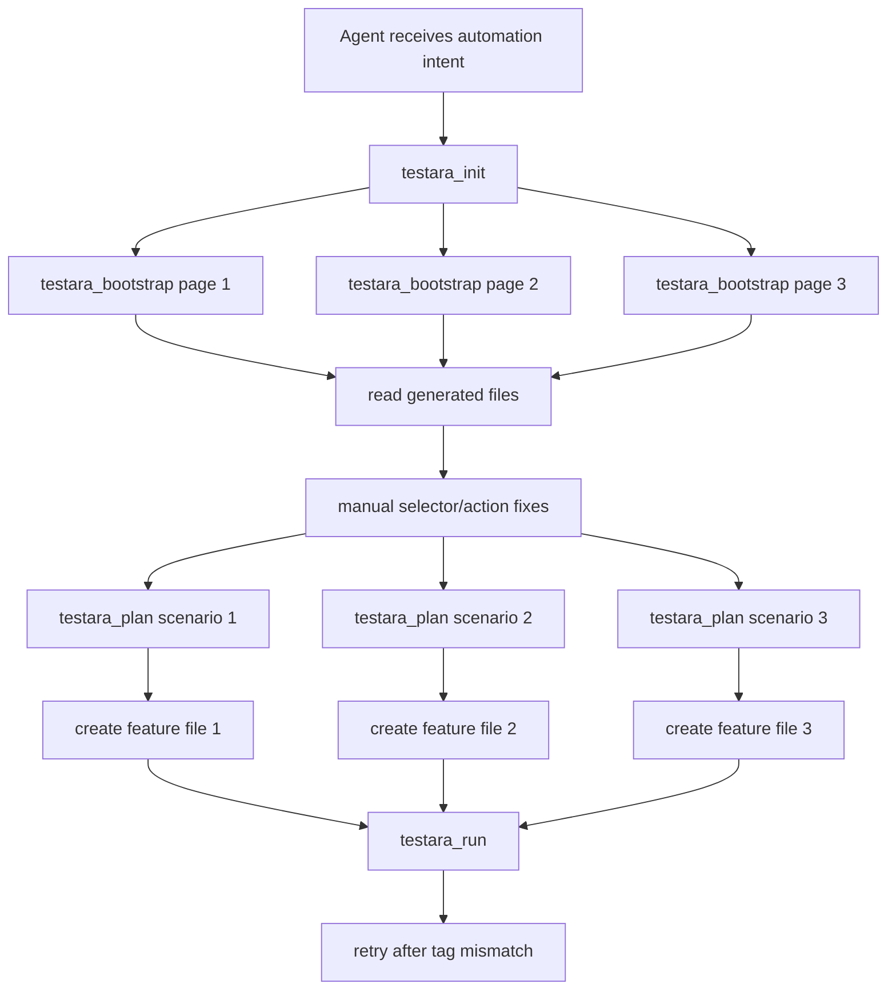
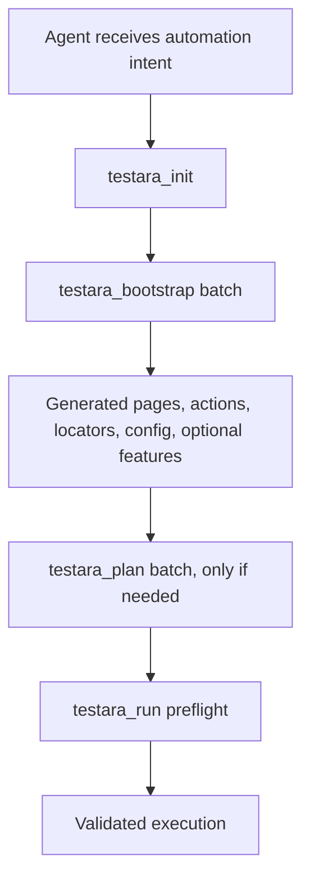
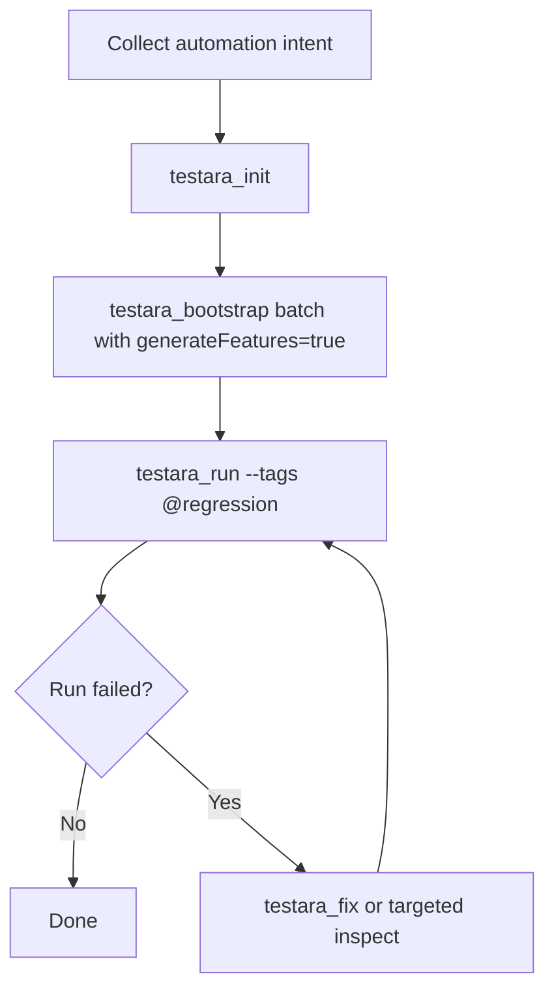
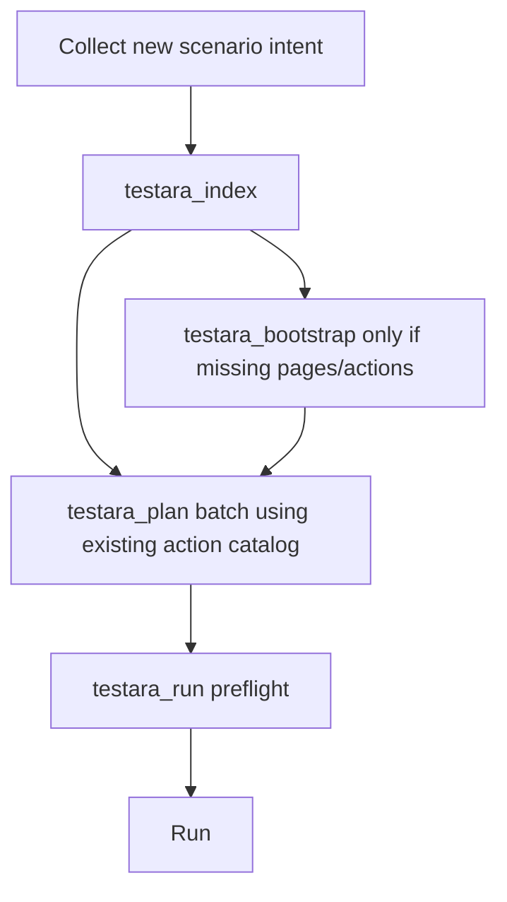

# Testara Agent Token Efficiency Improvement Plan

## 1. Objective

Improve Testara agent workflows so automation generation requires fewer turns, fewer tool calls, fewer file reads, and fewer manual correction cycles.

The core improvement is to make Testara tools more context-aware and batch-oriented:

- `testara_bootstrap` should become a powerful customizable template generator that can produce correct pages, actions, locators, configuration, and optional feature files from agent intent.
- `testara_plan` should support multiple scenarios and multiple feature files in a single call.
- `testara_plan` should consume existing `@Action`, page, locator, and step metadata before generating feature files.
- `testara_run` should validate tags before executing and suggest or auto-correct obvious mismatches.
- Testara should expose lightweight project metadata indexes to avoid repeated full file reads.

## 2. Current Feedback Summary

The analyzed session used around 36 tool calls and approximately 78K total tokens:

| Phase | Purpose | Tool Calls | Estimated Input Tokens | Estimated Output Tokens |
|---|---:|---:|---:|---:|
| Init | `askQuestions`, `testara_init` | 3 | ~15K | ~3K |
| Bootstrap Pages/Actions | `testara_bootstrap ×3` | 3 | ~8K | ~4K |
| Read & Review | `read_file ×8` | 8 | ~2K | ~6K |
| Fix Selectors & URLs | `replace_string_in_file ×6` | 6 | ~6K | ~1K |
| Generate Features | `testara_plan ×3` | 3 | ~5K | ~4K |
| Create Features | `create_file ×3` | 3 | ~4K | ~1K |
| Compile & Run | `run_in_terminal ×2 + read_file ×1` | 3 | ~2K | ~9K |
| Test Run Retry | `testara_run ×2 + read_file ×2` | 4 | ~4K | ~4K |
| **Total** |  | **36** | **~46K** | **~32K** |

Testara already reduced boilerplate generation by roughly 2–3× compared to manually generating all project files. However, the current toolchain still leaks tokens through wrong action names, placeholder selectors, feature/action mismatch, tag mismatch, and repeated file reads.

## 3. Main Problems To Solve

### 3.1 Long Generated Action Names

Observed problem:

```java
@Action("login page at https www saucedemo com with username ...")
public void loginPageAtHttpsWwwSaucedemoComWithUsername...() { ... }
```

Impact:

- Creates unreadable Java method names.
- Causes replacement cycles.
- Increases generated code size.
- Makes future feature planning less predictable.

Required fix:

Generate short semantic action names and separate the natural-language intent from the Java method name.

Example target:

```java
@Action("login with valid credentials")
public void loginWithValidCredentials() {
  // implementation
}
```

### 3.2 TODO Selectors

Observed problem:

```java
public static final Locator PRODUCT_CARD = Locator.css("TODO");
```

Impact:

- Forces the agent to read generated files.
- Forces manual selector edits.
- Delays runnable test creation.

Required fix:

Bootstrap should infer selectors using input DOM hints, known UI framework patterns, HTML snippets, accessibility attributes, and optional site profiles.

### 3.3 Feature Plans Not Matching Existing Actions

Observed problem:

`testara_plan` generated steps like:

```gherkin
When user login with credentials
```

But the actual action was:

```java
@Action("login with valid credentials")
```

Impact:

- Generated features fail to bind cleanly.
- Requires rewrite cycles.
- Increases tokens from file reads and edits.

Required fix:

`testara_plan` must inspect the project action catalog before writing feature files.

### 3.4 One Scenario Per Plan Call

Observed problem:

`testara_plan ×3` was used for three scenarios.

Impact:

- More tool-call overhead.
- More repeated context.
- More repeated output formatting.

Required fix:

`testara_plan` should support batch scenario generation and multiple feature files in a single call.

### 3.5 Tag Mismatch During Run

Observed problem:

The first run used a tag expression that matched nothing:

```text
@login and @positive and @negative and @cart
```

Impact:

- Wasted run call.
- Wasted build output tokens.
- Required retry.

Required fix:

`testara_run` should perform preflight tag validation before invoking Maven/Cucumber.

### 3.6 Redundant Reads

Observed problem:

Some generated files were read more than once.

Impact:

- Wastes tokens on repeated file contents.
- Forces the model to manage project state manually.

Required fix:

Expose a compact Testara project index and change summary instead of requiring full file reads.

## 4. Target Workflow

### 4.1 Current Workflow



### 4.2 Target Workflow



### 4.3 Expected Reduction

| Metric | Current | Target |
|---|---:|---:|
| Tool calls | ~36 | 8–14 |
| Full file reads | ~8 | 0–2 |
| Feature planning calls | 3 | 1 |
| Bootstrap calls | 3 | 1 |
| Selector correction cycles | 6 edits | 0–2 edits |
| Failed tag run retries | 1+ | 0 |
| Estimated total tokens | ~78K | ~25K–40K |

## 5. Proposed Tool Enhancements

## 5.1 Enhance `testara_bootstrap` Into a Customizable Template Generator

### Goal

Make `testara_bootstrap` capable of generating high-quality runnable files from structured or semi-structured agent input.

It should work like a customizable generation template, not just a simple page/action skeleton generator.

### Proposed Input Contract

```json
{
  "projectContext": {
    "baseUrl": "https://www.saucedemo.com",
    "domain": "ui",
    "frameworkFlavor": "testara-flavor",
    "packageBase": "com.example.automation"
  },
  "generationMode": "batch",
  "pages": [
    {
      "name": "LoginPage",
      "url": "/",
      "intent": "Login page for SauceDemo",
      "elements": [
        {
          "name": "username input",
          "semanticKey": "username",
          "selectorHints": ["#user-name", "input[name='user-name']"],
          "required": true
        },
        {
          "name": "password input",
          "semanticKey": "password",
          "selectorHints": ["#password", "input[name='password']"],
          "required": true
        },
        {
          "name": "login button",
          "semanticKey": "loginButton",
          "selectorHints": ["#login-button", "input[type='submit']"],
          "required": true
        }
      ],
      "actions": [
        {
          "name": "login with valid credentials",
          "methodName": "loginWithValidCredentials",
          "inputs": ["username", "password"],
          "usesProperties": true
        }
      ]
    }
  ],
  "features": {
    "generate": true,
    "featureFiles": [
      {
        "name": "login.feature",
        "tags": ["@regression", "@login"],
        "scenarios": [
          {
            "name": "Login successfully with valid credentials",
            "tags": ["@positive"],
            "steps": [
              "Given user is on login page",
              "When user login with valid credentials",
              "Then user should see inventory page"
            ]
          }
        ]
      }
    ]
  }
}
```

### Required Output

`testara_bootstrap` should return:

```json
{
  "createdFiles": [...],
  "updatedFiles": [...],
  "actionCatalog": [...],
  "pageCatalog": [...],
  "locatorCatalog": [...],
  "featureCatalog": [...],
  "warnings": [...],
  "nextRecommendedCommand": "testara_run --tags @regression"
}
```

### Implementation Notes

1. Accept multiple pages in one call.
2. Accept multiple actions per page.
3. Accept selector hints from the agent.
4. Generate concise Java method names.
5. Generate stable `@Action` values that match expected Gherkin steps.
6. Generate feature files optionally.
7. Return a compact catalog so the agent does not need to read files.
8. Avoid modifying global configuration repeatedly when called in batch mode.
9. Use idempotent file updates where possible.
10. Warn before overwriting existing files.

## 5.2 Add Action Naming Strategy

### Goal

Prevent huge method names and unstable action keys.

### Proposed Rules

| Input Intent | `@Action` Value | Java Method Name |
|---|---|---|
| Login to SauceDemo using valid credentials | `login with valid credentials` | `loginWithValidCredentials` |
| Add backpack product to cart | `add product to cart` | `addProductToCart` |
| Open cart page | `open cart page` | `openCartPage` |
| Verify product is visible | `verify product is visible` | `verifyProductIsVisible` |

### Method Name Constraints

| Constraint | Rule |
|---|---|
| Max length | 60 chars |
| Format | lowerCamelCase |
| Site URL | Never included |
| Credentials | Never included |
| Test data | Passed as parameters or properties |
| Duplicate name | Append stable suffix, e.g. `loginWithValidCredentials2` only if needed |

### Generated Example

```java
@Action("login with valid credentials")
public void loginWithValidCredentials() {
  on(LoginPage.class).usernameInput().fill(properties("saucedemo.username"));
  on(LoginPage.class).passwordInput().fill(properties("saucedemo.password"));
  on(LoginPage.class).loginButton().click();
}
```

## 5.3 Add Locator Inference Strategy

### Goal

Reduce or eliminate `Locator.css("TODO")` output.

### Selector Priority

| Priority | Selector Source | Example |
|---:|---|---|
| 1 | Explicit test id | `[data-testid='login-button']` |
| 2 | Stable id | `#login-button` |
| 3 | Stable name | `input[name='user-name']` |
| 4 | ARIA role/name | `button[aria-label='Login']` or role locator if supported |
| 5 | Placeholder | `input[placeholder='Username']` |
| 6 | Text-based locator | `button:has-text('Login')` if supported |
| 7 | CSS class only if stable | `.inventory_item` |
| 8 | XPath fallback | `//button[normalize-space()='Login']` |
| 9 | TODO with warning | `Locator.css("TODO")` only if no safe option exists |

### Proposed Selector Metadata

Each generated locator should include confidence metadata in the tool response:

```json
{
  "page": "LoginPage",
  "name": "loginButton",
  "locator": "Locator.css(\"#login-button\")",
  "confidence": "high",
  "reason": "stable id found from selector hints"
}
```

### Optional DOM Input

Allow the agent to provide raw HTML snippets or simplified DOM index:

```json
{
  "domHints": [
    "<input id='user-name' name='user-name' />",
    "<input id='password' name='password' />",
    "<input id='login-button' type='submit' value='Login' />"
  ]
}
```

Bootstrap should not need the full page source when concise DOM hints are enough.

## 5.4 Add Built-in Site Profiles

### Goal

Improve generation quality for commonly used demo sites and standard apps.

### Initial Profiles

| Site | Profile Key | Benefit |
|---|---|---|
| SauceDemo | `saucedemo` | Known login, inventory, cart selectors |
| TodoMVC | `todomvc` | Known todo input, list, filter selectors |
| The Internet Herokuapp | `the-internet` | Known form, checkbox, dropdown selectors |
| OrangeHRM Demo | `orangehrm` | Common login/dashboard selectors |

### Usage

```json
{
  "siteProfile": "saucedemo",
  "pages": ["login", "inventory", "cart"]
}
```

When a profile is selected, bootstrap may generate known stable locators without requiring DOM hints.

## 5.5 Enhance `testara_plan` To Support Multiple Scenarios And Feature Files

### Goal

Reduce one-call-per-scenario planning overhead.

### Proposed Input Contract

```json
{
  "mode": "batch",
  "featureFiles": [
    {
      "path": "src/test/resources/features/login.feature",
      "featureName": "Login",
      "tags": ["@regression", "@login"],
      "scenarios": [
        {
          "name": "Login successfully with valid credentials",
          "tags": ["@positive"],
          "intent": "User logs in and sees inventory page"
        },
        {
          "name": "Show error for invalid password",
          "tags": ["@negative"],
          "intent": "User enters invalid password and sees error"
        }
      ]
    },
    {
      "path": "src/test/resources/features/cart.feature",
      "featureName": "Cart",
      "tags": ["@regression", "@cart"],
      "scenarios": [
        {
          "name": "Add product to cart",
          "tags": ["@positive"],
          "intent": "User adds a product and sees it in cart"
        }
      ]
    }
  ],
  "useExistingActionCatalog": true,
  "createFiles": true
}
```

### Required Behavior

1. Generate multiple feature files in one call.
2. Reuse existing `@Action` values.
3. Prefer Testara built-in steps before creating custom steps.
4. Return unmatched scenario intents as warnings.
5. Optionally create files directly to avoid separate `create_file` calls.
6. Return a generated tag index.

### Proposed Output

```json
{
  "createdFeatureFiles": [
    "src/test/resources/features/login.feature",
    "src/test/resources/features/cart.feature"
  ],
  "usedActions": [
    "login with valid credentials",
    "add product to cart",
    "open cart page"
  ],
  "unresolvedActions": [],
  "tagIndex": ["@regression", "@login", "@positive", "@negative", "@cart"],
  "recommendedRun": "testara_run --tags @regression"
}
```

## 5.6 Make `testara_plan` Consume Existing Project Metadata

### Goal

Prevent feature steps from drifting away from existing actions.

### Metadata Sources

`testara_plan` should scan or receive:

- Existing `@Action` annotations.
- Existing page classes.
- Existing locator fields.
- Existing Testara base steps.
- Existing feature tags.
- Existing Cucumber step definitions.
- Existing `configuration.properties` user-defined values.

### Project Metadata Index

Introduce a lightweight command:

```text
testara_index
```

It returns compact metadata rather than full file content.

Example output:

```json
{
  "actions": [
    {
      "action": "login with valid credentials",
      "class": "LoginActions",
      "method": "loginWithValidCredentials",
      "parameters": []
    },
    {
      "action": "add product to cart",
      "class": "InventoryActions",
      "method": "addProductToCart",
      "parameters": ["productName"]
    }
  ],
  "pages": [
    {
      "name": "LoginPage",
      "url": "/",
      "locators": ["usernameInput", "passwordInput", "loginButton"]
    }
  ],
  "tags": ["@regression", "@login", "@cart"],
  "properties": ["saucedemo.username", "saucedemo.password"]
}
```

### Token Benefit

Instead of reading 5–10 Java files, the agent reads one compact index.

## 5.7 Add Bootstrap + Plan Chaining

### Goal

Avoid this expensive flow:

```text
bootstrap → read generated files → plan → create feature → fix mismatch
```

### Proposed Option

```json
{
  "generateFeatures": true,
  "featureGenerationMode": "fromActions",
  "featureFiles": [...]
}
```

When enabled, `testara_bootstrap` should:

1. Generate pages.
2. Generate actions.
3. Build internal action catalog.
4. Generate feature files using that catalog.
5. Return a run command.

### Best Use Case

Use this mode for greenfield automation creation where the agent knows the target scenarios upfront.

## 5.8 Improve `testara_run` Tag Preflight

### Goal

Prevent wasted runs when tag expressions match nothing.

### Required Behavior

Before Maven/Cucumber execution:

1. Read or build feature tag index.
2. Evaluate requested tag expression.
3. If zero scenarios match, do not run Maven.
4. Return nearest valid tag expressions.
5. Suggest a corrected command.

### Example

Input:

```text
testara_run --tags "@login and @positive and @negative and @cart"
```

Output:

```json
{
  "status": "preflight_failed",
  "reason": "Tag expression matched 0 scenarios",
  "availableTags": ["@regression", "@login", "@positive", "@negative", "@cart"],
  "suggestions": [
    "@regression",
    "@login or @cart",
    "(@login and @positive) or (@login and @negative) or (@cart and @positive)"
  ],
  "mavenExecuted": false
}
```

### Optional Auto-Correction

Allow:

```json
{
  "autoCorrectTags": true,
  "fallbackTag": "@regression"
}
```

Only apply auto-correction when the requested expression is impossible or contradictory.

## 5.9 Add File Change Summary Output

### Goal

Avoid repeated file reads after generation or modification.

Every mutating Testara tool should return:

```json
{
  "filesChanged": [
    {
      "path": "src/test/java/pages/LoginPage.java",
      "changeType": "created",
      "summary": "Created LoginPage with usernameInput, passwordInput, and loginButton locators",
      "symbols": ["LoginPage", "usernameInput", "passwordInput", "loginButton"]
    }
  ]
}
```

This lets the agent reason from summaries instead of full file content.

## 6. Revised Tool Responsibilities

| Tool | Current Role | Improved Role |
|---|---|---|
| `testara_init` | Create project baseline | Create baseline and return dependency/config summary |
| `testara_bootstrap` | Generate page/action skeletons | Batch customizable generator for pages, actions, locators, config, and optional features |
| `testara_plan` | Generate one scenario/feature plan | Generate multiple feature files and scenarios using project action catalog |
| `testara_index` | Not available | Return compact action/page/locator/tag/property catalog |
| `testara_run` | Execute test command | Preflight tags, validate config, execute only when meaningful |
| `testara_fix` | Not available | Optional targeted repair for selector/action/feature mismatch |

## 7. Proposed New Command: `testara_fix`

### Goal

Repair generated automation with compact intent instead of requiring manual file edits.

### Example Use Cases

```json
{
  "fixType": "selector",
  "target": "InventoryPage.productCard",
  "newLocator": "Locator.css(\".inventory_item\")"
}
```

```json
{
  "fixType": "feature-action-mismatch",
  "featurePath": "src/test/resources/features/login.feature",
  "strategy": "rewrite_feature_steps_to_existing_actions"
}
```

```json
{
  "fixType": "action-rename",
  "from": "loginPageAtHttpsWwwSaucedemoComWithUsernameStandardUserAndPasswordSecretSauce",
  "to": "loginWithValidCredentials",
  "actionText": "login with valid credentials"
}
```

### Benefit

One semantic repair call can replace several `read_file` and `replace_string_in_file` calls.

## 8. Recommended Generation Flow For Agents

### 8.1 Greenfield Project



### 8.2 Existing Project



## 9. Implementation Plan

## Phase 1 — Metadata Index And Action Naming

### Scope

- Add `testara_index`.
- Add action naming strategy.
- Return compact catalogs from existing tools.

### Tasks

| Task | Description | Priority |
|---|---|---:|
| Add action scanner | Scan `@Action` annotations and method metadata | P0 |
| Add page scanner | Scan `@Page`, locators, and page URLs | P0 |
| Add feature tag scanner | Scan feature files and tag expressions | P0 |
| Add property scanner | Scan property keys without exposing sensitive values | P1 |
| Add method name sanitizer | Enforce concise lowerCamelCase names | P0 |
| Add catalog response | Return action/page/locator/tag catalog after bootstrap | P0 |

### Acceptance Criteria

- Agent can retrieve all action names without reading Java files.
- Generated method names never exceed 60 characters unless explicitly overridden.
- URLs, credentials, and long scenario text are not embedded into method names.
- `testara_bootstrap` returns created symbols and action catalog.

## Phase 2 — Batch Bootstrap

### Scope

Upgrade `testara_bootstrap` to support multiple pages and actions in one call.

### Tasks

| Task | Description | Priority |
|---|---|---:|
| Add batch input schema | Accept multiple pages/actions/features | P0 |
| Add idempotent writer | Avoid duplicate config and class writes | P0 |
| Add template customization | Support package, base URL, framework flavor, and naming options | P0 |
| Add selector hints | Accept selector hints per element | P0 |
| Add warning output | Warn on low-confidence locators | P1 |
| Add site profile hook | Let bootstrap use known selector presets | P1 |

### Acceptance Criteria

- Three pages can be generated in one bootstrap call.
- Global files are updated once.
- Generated files compile without manual method-name cleanup.
- Tool output includes a concise summary of all created/updated files.

## Phase 3 — Locator Inference

### Scope

Reduce `TODO` locators.

### Tasks

| Task | Description | Priority |
|---|---|---:|
| Add selector ranking | Rank explicit selectors over brittle selectors | P0 |
| Add DOM hints parser | Parse small HTML snippets into candidate locators | P1 |
| Add known site profiles | Start with SauceDemo | P1 |
| Add locator confidence | Return high/medium/low confidence per locator | P1 |
| Add TODO guardrail | Emit `TODO` only with explicit warning | P0 |

### Acceptance Criteria

- SauceDemo login, inventory, and cart pages generate usable selectors.
- `Locator.css("TODO")` appears only when no candidate exists.
- Low-confidence selectors are clearly reported.

## Phase 4 — Batch `testara_plan`

### Scope

Allow one call to generate multiple scenarios and feature files.

### Tasks

| Task | Description | Priority |
|---|---|---:|
| Add batch scenario schema | Accept multiple features and scenarios | P0 |
| Consume action catalog | Prefer existing `@Action` values | P0 |
| Add built-in step catalog | Prefer Testara base steps where applicable | P0 |
| Add direct file creation | Optional `createFiles=true` | P1 |
| Add unresolved action report | Report scenario intents that cannot map cleanly | P0 |
| Add tag index output | Return all generated tags and recommended run command | P0 |

### Acceptance Criteria

- One `testara_plan` call can create at least three feature files.
- Generated Gherkin uses existing action names exactly.
- Tool returns unresolved actions instead of inventing mismatched steps.
- Tool can write feature files directly when requested.

## Phase 5 — Bootstrap + Plan Chaining

### Scope

Generate runnable project structure and feature files from one bootstrap call.

### Tasks

| Task | Description | Priority |
|---|---|---:|
| Add `generateFeatures` option | Generate feature files after pages/actions | P1 |
| Build internal action catalog | Use generated actions immediately | P1 |
| Return recommended run | Suggest valid tag expression | P1 |
| Validate generated features | Ensure generated steps match action catalog | P0 |

### Acceptance Criteria

- A greenfield UI automation project can be initialized, bootstrapped, and feature-generated in two calls: `testara_init` and `testara_bootstrap`.
- No feature/action mismatch occurs in generated output.

## Phase 6 — `testara_run` Preflight

### Scope

Avoid wasted Maven/Cucumber runs.

### Tasks

| Task | Description | Priority |
|---|---|---:|
| Add tag scanner | Build tag index from feature files | P0 |
| Add tag expression evaluator | Detect zero-match expressions | P0 |
| Add nearest suggestion | Recommend valid expressions | P1 |
| Add no-run preflight failure | Do not execute Maven on zero-match tags | P0 |
| Add optional auto-correct | Use safe fallback tag if enabled | P2 |

### Acceptance Criteria

- `testara_run` does not execute Maven when tags match zero scenarios.
- Output shows available tags and corrected suggestions.
- Agent can retry using compact output, not full build logs.

## Phase 7 — Semantic Repair Tool

### Scope

Add `testara_fix` for targeted corrections.

### Tasks

| Task | Description | Priority |
|---|---|---:|
| Add selector fix | Update a locator by symbolic page/locator name | P1 |
| Add action rename | Rename method and `@Action` safely | P1 |
| Add feature rewrite | Rewrite feature steps to existing actions | P1 |
| Add dry-run diff | Return compact diff before applying if requested | P2 |

### Acceptance Criteria

- Common generated-code fixes require one semantic call instead of multiple file reads and string replacements.
- Tool returns safe summary and changed symbols.

## 10. Recommended API Shapes

## 10.1 `testara_bootstrap` Batch Mode

```json
{
  "mode": "batch",
  "project": {
    "baseUrl": "https://www.saucedemo.com",
    "packageBase": "com.example.automation",
    "flavor": "testara-flavor"
  },
  "naming": {
    "actionMethodMaxLength": 60,
    "preferSemanticNames": true,
    "excludeUrlFromMethodName": true,
    "excludeDataFromMethodName": true
  },
  "locator": {
    "strategy": "ranked",
    "allowTodo": false,
    "siteProfile": "saucedemo"
  },
  "pages": [],
  "actions": [],
  "features": {
    "generate": true,
    "createFiles": true,
    "featureFiles": []
  }
}
```

## 10.2 `testara_plan` Batch Mode

```json
{
  "mode": "batch",
  "useExistingActionCatalog": true,
  "preferBuiltInSteps": true,
  "createFiles": true,
  "featureFiles": []
}
```

## 10.3 `testara_run` Preflight Mode

```json
{
  "tags": "@regression",
  "preflight": true,
  "executeWhenZeroMatch": false,
  "suggestOnMismatch": true
}
```

## 11. Example Optimized Agent Session

### Step 1 — Initialize

```text
testara_init projectName=saucedemo-ui packageBase=com.example.automation flavor=testara-flavor
```

### Step 2 — Batch Bootstrap Pages, Actions, And Features

```text
testara_bootstrap mode=batch siteProfile=saucedemo generateFeatures=true
```

Generated in one call:

- `LoginPage.java`
- `InventoryPage.java`
- `CartPage.java`
- `LoginActions.java`
- `InventoryActions.java`
- `CartActions.java`
- `login.feature`
- `cart.feature`
- `configuration.properties` updates
- Action catalog
- Tag index
- Recommended run command

### Step 3 — Run

```text
testara_run --tags @regression
```

Expected total:

| Step | Calls |
|---|---:|
| Init | 1 |
| Bootstrap + features | 1 |
| Run | 1 |
| Optional fix | 0–2 |
| **Total** | **3–5** |

## 12. Token Efficiency Targets

| Improvement | Estimated Token Saving |
|---|---:|
| Batch bootstrap | 4K–8K |
| Batch feature planning | 4K–8K |
| Action catalog reuse | 3K–6K |
| Avoid full file reads | 5K–10K |
| Tag preflight | 2K–6K |
| Selector inference | 2K–5K |
| Semantic fix command | 2K–8K |
| **Total Expected Saving** | **22K–51K** |

## 13. Guardrails

### 13.1 Do Not Over-Automate Incorrect Selectors

If selector confidence is low, Testara should prefer explicit warnings over silently generating brittle locators.

Example:

```json
{
  "warning": "Locator for InventoryPage.productCard has low confidence. Generated CSS '.inventory_item' from class pattern. Consider adding data-testid."
}
```

### 13.2 Do Not Expose Secret Property Values

`testara_index` may expose property keys, but not secret values.

Safe:

```json
{
  "properties": ["saucedemo.username", "saucedemo.password"]
}
```

Unsafe:

```json
{
  "saucedemo.password": "secret_sauce"
}
```

### 13.3 Do Not Invent Actions Silently

When `testara_plan` cannot map an intent to an existing action or built-in step, it should either:

1. Generate a missing action stub and report it, or
2. Return an unresolved action warning.

It should not generate feature steps that are unlikely to bind.

## 14. Testing Strategy

## 14.1 Unit Tests

| Component | Test Cases |
|---|---|
| Action name generator | Long URL intent, credential intent, duplicate action intent |
| Selector ranker | id, name, data-testid, ARIA, text, class fallback |
| Action scanner | Multiple classes, duplicate `@Action`, parameterized actions |
| Feature tag scanner | Feature-level tags, scenario-level tags, scenario outline tags |
| Tag expression evaluator | valid expression, contradiction, zero-match, OR expression |
| Batch planner | Multiple features, multiple scenarios, existing action reuse |

## 14.2 Integration Tests

| Scenario | Expected Result |
|---|---|
| Generate SauceDemo login/inventory/cart in one bootstrap call | Compiles and runs |
| Generate three feature files in one plan call | Files created and tags indexed |
| Run with invalid tag expression | Maven not executed, suggestions returned |
| Existing project with actions | Plan uses existing `@Action` values |
| Missing selector hints | Bootstrap warns instead of silently using bad locator |

## 14.3 Regression Tests

Use the original inefficient session as a benchmark:

| Benchmark | Baseline | Target |
|---|---:|---:|
| Tool calls | 36 | <= 14 |
| Manual file reads | 8 | <= 2 |
| Manual replacements | 6 | <= 2 |
| Failed no-match run | 1 | 0 |
| Feature/action mismatch | 3 files | 0 |

## 15. Backward Compatibility

Existing tools should continue supporting current single-page and single-scenario input.

Recommended approach:

- Keep current simple input fields.
- Add `mode=batch` for the new schema.
- Add warnings when legacy mode produces lower-quality output.
- Gradually update agent skill documentation to prefer batch mode.

## 16. Documentation Updates Required

Update the Testara agentic skill documentation with:

1. Preferred greenfield workflow.
2. Preferred existing-project workflow.
3. `testara_bootstrap` batch examples.
4. `testara_plan` multi-feature examples.
5. Action naming rules.
6. Locator inference rules.
7. `testara_index` usage.
8. `testara_run` tag preflight behavior.
9. Troubleshooting guide for feature/action mismatch.
10. Token-efficient prompting examples.

## 17. Agent Prompting Guidance

Agents should prefer this order:

1. Use `testara_index` for existing projects.
2. Use `testara_bootstrap` batch mode for pages/actions.
3. Use `generateFeatures=true` when scenarios are already known.
4. Use `testara_plan` batch mode when features need to be generated separately.
5. Use `testara_run` with preflight enabled.
6. Use `testara_fix` for semantic repairs.
7. Read full files only when compact metadata is insufficient.

Agents should avoid:

- Reading generated files immediately after bootstrap when the tool already returned a catalog.
- Calling `testara_plan` once per scenario.
- Creating feature files separately if `testara_plan` can write them directly.
- Running with unvalidated tag expressions.
- Replacing strings manually when a semantic Testara fix command exists.

## 18. Priority Roadmap

| Priority | Item | Reason |
|---:|---|---|
| P0 | Concise action naming | Removes immediate correction cycle |
| P0 | Batch `testara_plan` | Reduces per-scenario call overhead |
| P0 | Existing action catalog usage | Prevents feature/action mismatch |
| P0 | `testara_run` tag preflight | Prevents wasted execution calls |
| P0 | Compact metadata output | Reduces repeated file reads |
| P1 | Batch `testara_bootstrap` | Reduces page/action generation overhead |
| P1 | Locator inference | Reduces selector repair cycles |
| P1 | Bootstrap + feature chaining | Enables near one-shot generation |
| P1 | `testara_index` command | Improves existing-project workflows |
| P2 | `testara_fix` command | Makes repair workflow more semantic |
| P2 | Site profiles | Improves known demo/app generation quality |

## 19. Final Recommendation

The highest-impact change is to make Testara tools return and consume compact project catalogs.

The second highest-impact change is to make both bootstrap and planning batch-oriented:

- `testara_bootstrap` should generate multiple pages/actions from one structured input.
- `testara_plan` should generate multiple scenarios and feature files in one call.

The third highest-impact change is to make the generated artifacts internally consistent:

- Action names must be concise and semantic.
- Feature steps must be generated from the actual action catalog.
- Tags must be validated before running.
- Locators should be inferred where possible and explicitly warned when uncertain.

With these changes, a typical three-scenario UI automation task should move from around 36 calls and ~78K tokens to approximately 8–14 calls and ~25K–40K tokens, with fewer failed runs and fewer manual edits.
